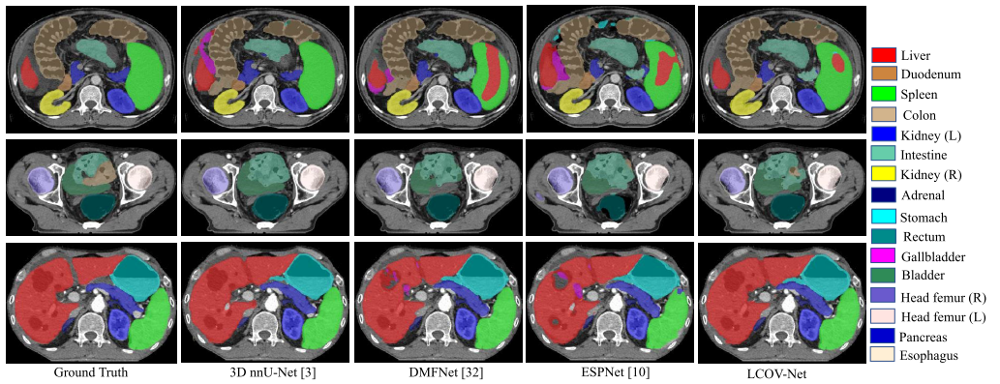
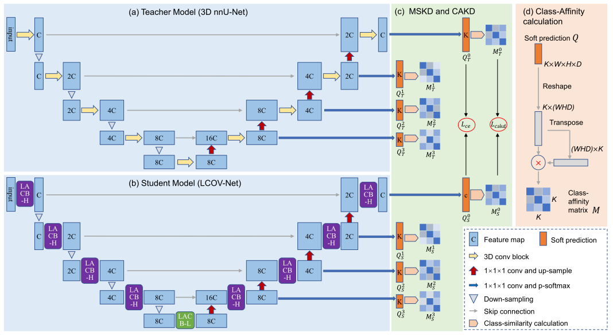
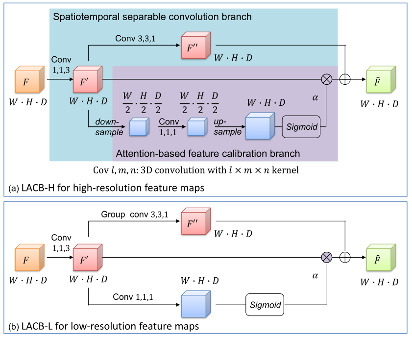

# LCOV-Net: A lightweight CNN for 3D image segmentation with knowledge distillation
[tmi_link]:https://ieeexplore.ieee.org/document/10083150
[isbi_link]:https://ieeexplore.ieee.org/abstract/document/9434023
[word_link]:https://www.sciencedirect.com/science/article/abs/pii/S1361841522002705
[pymic_link]:https://github.com/HiLab-git/PyMIC
[pymic_example]:https://github.com/HiLab-git/PyMIC_examples
[baidu_link]:https://pan.baidu.com/s/1HwD1iqHorgXfYXnrChdzIg

This repository provides the code for the LCOV-Net that was publihsed on [ISBI 2021][isbi_link] and IEEE [TMI 2023][tmi_link]:

* Q. Zhao, L. Zhong, J. Xiao, J. Zhang, Y. Chen, W. Liao, S. Zhang, G. Wang. “Efficient Multi-Organ Segmentation from 3D Abdominal CT Images with Lightweight Network and Knowledge Distillation.” IEEE Transactions on Medical Imaging, 42, no. 9  (2023): 2513-2523.

* Q. Zhao, H. Wang, G. Wang. "LCOV-NET: A Lightweight Neural Network For COVID-19 Pneumonia Lesion Segmentation From 3D CT Images", in IEEE ISBI, pp 42-45, 2021.

Visual comparison between different networks for abdominal organ segmentation on the [WORD][word_link] dataset.

Overview of our proposed lightweight LCOV-Net and KD strategies. LCOV-Net is built on our Lightweight Attention-based Convolutional Blocks (LACB-H and LACB-L) to reduce the model size. To improve itsmperformance, we introduce Class-Affinity Knowledge Distillation (CAKD) and Multi-Scale Knowledge Distillation (MSKD) as shown in (c) to effectively distill knowledge from a heavy-weight teacher model to LCOV-Net. Note that for simplicity, the KD losses are only shown for the highest resolution level.

Our proposed LACB for efficient computation.

# DataSet
Please contact Xiangde (luoxd1996 AT gmail DOT com) for the dataset (**the label of the testing set can be downloaded now [labelTs](https://github.com/HiLab-git/WORD/blob/main/WORD_V0.1.0_labelsTs.zip)**). Two steps are needed to download and access the dataset: **1) using your google email to apply for the download permission ([Goole Driven](https://drive.google.com/drive/folders/16qwlCxH7XtJD9MyPnAbmY4ATxu2mKu67?usp=sharing), [BaiduPan](https://pan.baidu.com/s/1mXUDbUPgKRm_yueXT6E_Kw))**; **2) using your affiliation email to get the unzip password/BaiduPan access code**. We will get back to you within **two days**, **so please don't send them multiple times**. We just handle the **real-name email** and **your email suffix must match your affiliation**. The email should contain the following information:

    Name/Homepage/Google Scholar: (Tell us who you are.)
    Primary Affiliation: (The name of your institution or university, etc.)
    Job Title: (E.g., Professor, Associate Professor, Ph.D., etc.)
    Affiliation Email: (the password will be sent to this email, we just reply to the email which is the end of "edu".)
    How to use: (Only for academic research, not for commercial use or second-development.)
    
In addition, this work is still ongoing, the **WORD** dataset will be extended to larger and more diverse (more patients, more organs, and more modalities, more clinical hospitals' data and MR Images will be considered to include future), any **suggestion**, **comment**, **collaboration**, and **sponsor** are welcome. 

# How to use
1. Install [PyMIC][pymic_link], and add files to Pymic.
2. Download the pretrained model and example CT images from [Baidu Netdisk][baidu_link] (extract code 9jlj).
3. Run `./KD/run.sh`. The results will be saved in `./KD/model/kd`.

# How to Cite
BibTeX entry for this work:

    @article{zhao2023tmi,
    author={Zhao, Qianfei and Zhong, Lanfeng and Xiao, Jianghong and Zhang, Jingbo and Chen, Yinan and Liao, Wenjun and Zhang, Shaoting and Wang, Guotai},
    journal={IEEE Transactions on Medical Imaging}, 
    title={Efficient Multi-Organ Segmentation From 3D Abdominal CT Images With Lightweight Network and Knowledge Distillation}, 
    year={2023},
    volume={42},
    number={9},
    pages={2513-2523},
    doi={10.1109/TMI.2023.3262680}}
    
    @inproceedings{zhao2021isbi,
    author={Zhao, Qianfei and Wang, Huan and Wang, Guotai},
    booktitle={2021 IEEE 18th International Symposium on Biomedical Imaging (ISBI)}, 
    title={LCOV-NET: A Lightweight Neural Network For COVID-19 Pneumonia Lesion Segmentation From 3D CT Images}, 
    year={2021},
    volume={},
    number={},
    pages={42-45},
    doi={10.1109/ISBI48211.2021.9434023}}